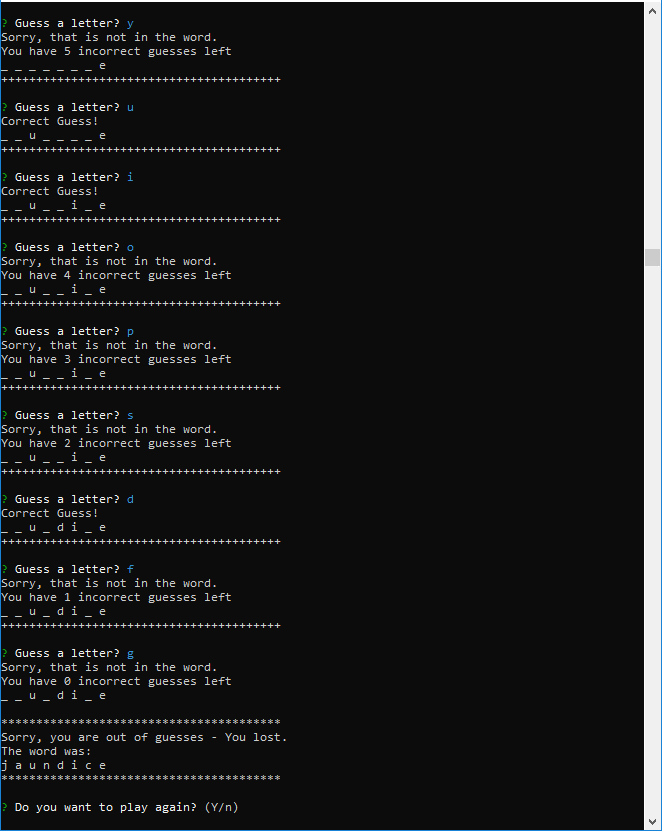

# **WordGuess-Cli**
### Command Line Constructor Word Guess Game
### Author: Rod Skoglund
### Date: July 26, 2018

# **Table Of Contents**
----------------
1. Application Introduction
2. Instructions
3. Minimum Requirements
4. Example Results

## **1. Application Introduction**
This application uses node.js to provide a command line interface to implement a Word Guessing Game application.

The user is presented with a word and asked to guess letters in an attempt to guess the word. The user will be allowed as many as 10 incorrect guesses. Repeat of a guessed letter does not count against your number of incorrect guesses. 

## **2. Instructions**
The application will present a word with all the letters replaced by "_". As you guess letters, the correct letters will be displayed so you can track your progress. If you guess all the letters before you run out of guesses, you win, You will be shown the word and asked if you want to play again.

If you make an incorrect guess, the incorrect letter count will be decremented. When it reaches 0, you will be shown the word and asked if you want to play again.

The game will end when you respond with "n" when asked if you want to play again.

## **3. Minimum Requirements**
In order to run this application, you will need the following utilities and packages:
 * node.js
 * The following npm packages:
    * "inquirer": "^6.0.0",
    * "require": "^2.4.20"

## **4. Example Results**
### An example where someone wins:

### An example where someone loses:

Enjoy :smiley: 